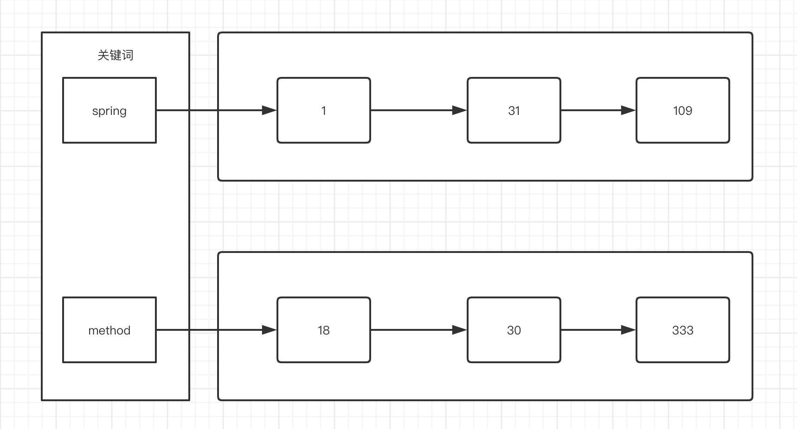

### Lucene



#### 依赖

基于 lucene 读取文件中的信息的具体实现，首先引入依赖

```xml
<properties>
  <lucene.version>8.0.0</lucene.version>
</properties>
<!-- https://mvnrepository.com/artifact/org.apache.lucene/lucene-core -->
<dependency>
  <groupId>org.apache.lucene</groupId>
  <artifactId>lucene-core</artifactId>
  <version>${lucene.version}</version>
</dependency>
<!-- https://mvnrepository.com/artifact/org.apache.lucene/lucene-analyzers-common -->
<dependency>
  <groupId>org.apache.lucene</groupId>
  <artifactId>lucene-analyzers-common</artifactId>
  <version>${lucene.version}</version>
</dependency>
<!-- https://mvnrepository.com/artifact/commons-io/commons-io -->
<dependency>
  <groupId>commons-io</groupId>
  <artifactId>commons-io</artifactId>
  <version>2.6</version>
</dependency>

```

#### 创建索引库

```java
public void createIndex() throws Exception{
  // 索引库存储在内存中
  //        Directory directory = new RAMDirectory();
	// 确定索引库位置
  File indexFile = new File("/Users/fox/Documents/luceneIndex");
  // 创建一个 Directory 对象并指定索引库位置
  Directory directory = FSDirectory.open(indexFile.toPath());
	// 基于 Directory 对象创建索引写入对象
  IndexWriter indexWriter = new IndexWriter(directory, new IndexWriterConfig());

  File dir = new File("/Users/fox/Documents/searchsource");
  if (dir.isDirectory()) {
    File[] files = dir.listFiles();
    // 遍历磁盘上的文件
    for (File file : files) {
      String name = file.getName();
      String path = file.getPath();
      long fileSize = FileUtils.sizeOf(file);
      String fileContent = FileUtils.readFileToString(file, "UTF-8");

      // 构建文件域
      Field fieldName = new TextField("name", name, Field.Store.YES);
      Field fieldPath = new TextField("path", path, Field.Store.YES);
      Field fieldSize = new TextField("size", fileSize + "", Field.Store.YES);
      Field fieldContent = new TextField("content", fileContent, Field.Store.YES);

      // 将域添加到文件对象中
      Document document = new Document();
      document.add(fieldName);
      document.add(fieldPath);
      document.add(fieldSize);
      document.add(fieldContent);

      // 文件添加到索引库中
      indexWriter.addDocument(document);

    }
  }
  // 关闭资源
  indexWriter.close();

}

```

#### 查询索引库

```java
public void queryIndex() throws Exception {
  // 创建 Directory 对象，打开已经创建的索引库
  File indexFile = new File("/Users/fox/Documents/luceneIndex");
  Directory directory = FSDirectory.open(indexFile.toPath());

  IndexReader indexReader = DirectoryReader.open(directory);
  IndexSearcher indexSearcher = new IndexSearcher(indexReader);
  // 关键词 cointent 内容中包含 mirco
  Term content = new Term("content", "and");
  TermQuery term = new TermQuery(content);
  // 分页查询出包含关键词 term 的前两条数据
  TopDocs topDocs = indexSearcher.search(term, 2);

  // 获取查询总结果数目
  TotalHits totalHits = topDocs.totalHits;
  System.out.println("查询总结果数：" + totalHits);

  // 获取分页查询结果
  ScoreDoc[] scoreDocs = topDocs.scoreDocs;
  for (ScoreDoc scoreDoc : scoreDocs) {
    int docId = scoreDoc.doc;
    Document doc = indexSearcher.doc(docId);
    String name = doc.get("name");
    String path = doc.get("path");
    System.out.println("name :" + name +"; path" + path);
  }

}
```

#### 中文分析器 IKAnalyzer 的使用

1. 添加 jar 包
2. 添加配置文件和扩展字典
   1. 扩展词典中包含一部分新词汇
   2. 停用词典包含无意义的词以及敏感词汇

```java
public void testTokenStream() throws Exception {
  // 标准的分析器
  //        String str =  "Quickly deliver production‑grade features with independently evolvable microservices.\n" +
  //                "Their small scale and relative isolation can lead to many additional benefits, such as easier maintenance, improved productivity, greater fault tolerance, better business alignment, and more.";
  //        Analyzer analyzer = new StandardAnalyzer();
  // 从 String 中获取 tokenStream
  //        TokenStream tokenStream = analyzer.tokenStream("", str);

  // 中文 IK 分析器
  Analyzer analyzer = new IKAnalyzer();
  String str =  "海底捞，这个世界都是并发的，编程里更是这样，俗话说：并发知识大，一口吃不下。想成为一名优秀的 Java 开发，学好并发，绝对是你走入高薪行列的必备能力之一。";
  TokenStream tokenStream = analyzer.tokenStream("", str);

  // 设置字符串关键词的引用
  CharTermAttribute charTermAttribute = tokenStream.addAttribute(CharTermAttribute.class);
  // 使用 increamentToken 方法之前需要先重置状态，否则会抛出异常，本质上可以理解为重置指针的位置
  tokenStream.reset();
  // 消费者消费，将流推进到下一个 token
  while (tokenStream.incrementToken()) {
    System.out.println(charTermAttribute.toString());
  }
}
```

#### Field 域

是否存储的标准取决于是否要展示内容，索引则是负责查询。所以即便没有存储，只要建立了索引就可以查询到。

| Field 类  | 数据类型   | 分析 | 索引 | 存储 |                             说明                             |
| --------- | ---------- | ---- | ---- | ---- | :----------------------------------------------------------: |
| String    | 字符串     | N    | Y    |      | 构建字符换但不分析，整串存储在索引中，是否存储在文档中自定义（身份证号） |
| LongPoint | Long       | Y    | Y    | N    |   存储数值，存储在索引，但不能存储数据（参与运算，不存储）   |
| Stored    | 多种       | N    | N    | Y    |                 不分析，不索引，存储在文档中                 |
| Text      | 字符串，流 | Y    | Y    |      |                 内容多的时候 unstored 的策略                 |

```java

Field fieldName = new TextField("name", name, Field.Store.YES);
Field fieldPath = new StoredField("path", path);
Field fieldSize = new StoredField("size", fileSize);
Field fieldSizeValue = new LongPoint("size", fileSize);
Field fieldContent = new TextField("content", fileContent, Field.Store.YES);
```

#### 索引库的增删改

添加

 ```java
@Before
public void init() throws Exception{
  File indexFile = new File("/Users/fox/Documents/luceneIndex");
  Directory directory = FSDirectory.open(indexFile.toPath());

  IndexWriterConfig indexWriterConfig = new IndexWriterConfig(new IKAnalyzer());

  indexWriter = new IndexWriter(directory, indexWriterConfig);
}

@Test
public void addDocument() throws Exception {
  Document document = new Document();
  document.add(new TextField("name", "新添加的文件", Field.Store.YES));
  // 文档的域不需要完全一致
  indexWriter.addDocument(document);
  indexWriter.close();

}
 ```

删除

```java
// 删除全部
indexWriter.deleteAll();
// 根据关键词查询删除
indexWriter.deleteDocuments(new Term("name", "文件"));
```

修改

```java
// 查询出结果删除，然后添加新的 document 中
indexWriter.updateDocument(new Term("name", "文件"), document);
```

#### 查询

1. 关键词查询和范围查询
2. `QueryPaser` 查询：对于查询内容先分词，在基于分词结果就查询 

