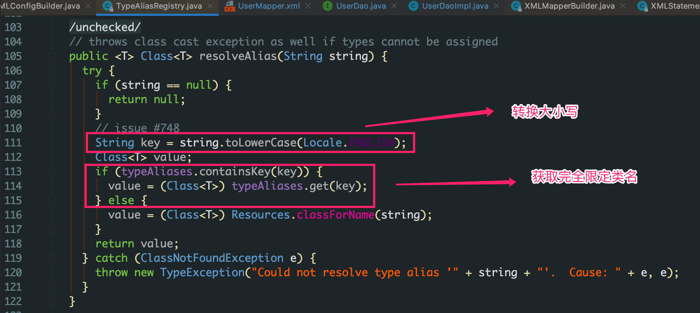
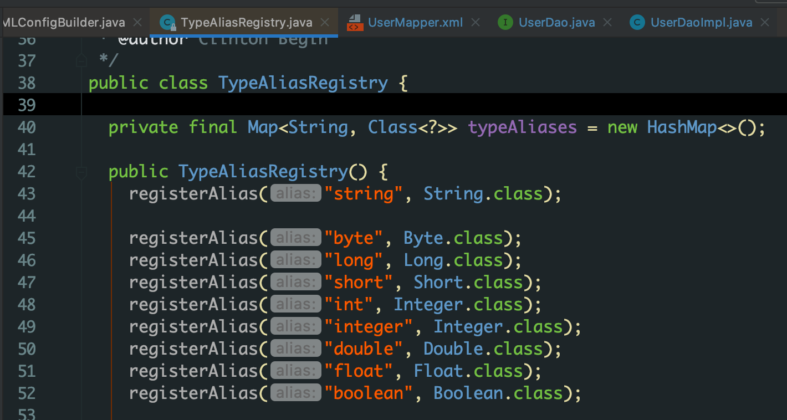
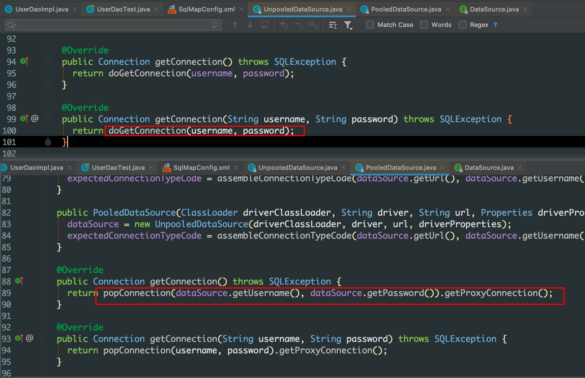

概念：java 持久层框架，内部封装了 jdbc，采用 ORM 思想通过实体类操作对应表。

### 入门
案例
1. SqlSessionFactoryBuilder  
	读取 SqlMapConfig.xml 配置文件，创建 SqlSessionFactory 对象

2. SqlSessionFactory  
    读取配置文件中连接数据库的信息以及Mapper映射信息，生产 SqlSession 对象

3. **SqlSession**  
	负责操作数据库，定义基础的增删改查
	生产接口代理对象

4. 封装结果集

```java
public class MapperProxy implements InvocationHandler {
    private Map<String, Mapper> mappers;

    private Connection conn;

    public MapperProxy(Map<String, Mapper> mappers, Connection conn) {
        this.mappers = mappers;
        this.conn = conn;
    }

    @Override
    public Object invoke(Object proxy, Method method, Object[] args) throws Throwable {
        String className = method.getDeclaringClass().getName();
        String name = method.getName();
        String key = className + name;
        Mapper mapper = mappers.get(key);
        return new Excutor().selectList(mapper, conn);
    }
}

// 封装了查询操作
public class Excutor {
    private static final Logger LOGGER = LoggerFactory.getLogger(Excutor.class);

    public <E> List<E> selectList(Mapper mapper, Connection conn) throws Exception {
        long startime = System.currentTimeMillis();
        LOGGER.debug("查询集合，开始时间：{}", startime);
        String queryString = mapper.getQueryString();
        String resultType = mapper.getResultType();
        Class domainClass = Class.forName(resultType);

        List<E> result = new ArrayList<>();

        PreparedStatement preparedStatement = conn.prepareStatement(queryString);
        ResultSet resultSet = preparedStatement.executeQuery();

        // 遍历的是结果条数
        while (resultSet.next()) {
            // 获取返回结果对象
            E rsobject = (E) domainClass.newInstance();
            // 获取结果元数据
            ResultSetMetaData metaData = resultSet.getMetaData();
            // 获取总列数
            int columnCount = metaData.getColumnCount();
            // 遍历每列，取出对应中的所有属性
            for (int i = 1; i <= columnCount; i++) {
                // 获取每列的列名
                String columnName = metaData.getColumnName(i);
                // 根据列名获取到列的值
                Object columnValue = resultSet.getObject(columnName);
                // 借助 Java 内省机制，实现属性的封装
                PropertyDescriptor pd = new PropertyDescriptor(columnName, domainClass);
                Method writeMethod = pd.getWriteMethod();
                writeMethod.invoke(rsobject, columnValue);
            }
            result.add(rsobject);
        }

        long end = System.currentTimeMillis();
        LOGGER.debug("查询集合，结束时间：{}， 共耗时：{}", end, end - startime);
        return result;
    }
}
```

### 源码阅读
动态代理的实现
```java
@Override
public Object invoke(Object proxy, Method method, Object[] args, SqlSession sqlSession) throws Throwable {
  return mapperMethod.execute(sqlSession, args);
}
```
此处代码调用了 sqlSession 中的一些对于数据库增删改查的基础操作完成了对于数据库的操作

### 增删改查的应用
如果参数只有一个并且是 基本类型或者是包装类 ，那么在 sql 中的占位符可以随意命名。

* <strong>parameterType</strong> 的应用，在 xml 中 parameterType 可以配置为 int ，INT 或者 integer
  

Mybatis 在解析 xml 的时候会先将配置内容转成小写，并且预先设定的内容获取到 int 的完全限定类名 






#### 连接池

* 概念：本质上是存储连接的容器「线程安全的集合对象」，还需要实现队列特性「先进先出」

POOLED 是 Mybatis 实现的连接池，而 UNPOOLED 并没有实现连接池，我们可以从代码中看出，POOLED 连接池获取连接的方式是 pop 也就是典型的队列思路。
 

