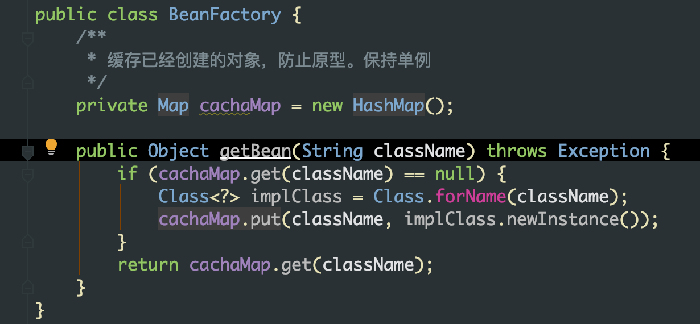

### 引子

代码业务逻辑越复杂，类之间的依赖关系就越发复杂，为了降低类之间的耦合度。从而避免牵一发而动全身的局面，我们可以采用工厂类和反射的方式给类解耦。




原先代码是如果需要创建 accountDao 接口需要 new 一个实现类，修改后通过 BeanFactory 和反射获取就将 accountDao 和实现类解耦。

**注意：** BeanFactory 获取对象实例的时候需要保留一个 map 用于缓存已经创建的对象，而 BeanFactory 对象需要在测试类的 `@Before` 方法中创建。否则在多次获取实现类会得到多个不同的实现类

> 扩展：servlet 也是单例的，所以我们在 Controller 中使用成员变量需要考虑线程安全的问题，只做读操作。

BeanFactory 改造升级，将 BeanFactory 对象的初始化放在 静态代码块中，保持类只会加载一次，通过 static 方法直接获取对象。


### 控制反转

#### ApplicationContext 

applicationContext 容器被称为 Spring 的上下文，是 BeanFactory 的子接口，相当于是 BeanFactory 的加强版功能


* ApplicationContext 和 BeanFactory 的区别
  * ApplicationContext 立即加载，在容器获取到的时候就完成了对于 Bean 的创建和加载，而 BeanFactory 则是延迟加载。
  * 注意：两者默认都是单例的
  * 当作用域为原型，ApplicationContext 同样变成延迟加载

#### 注解

##### 其他类型的注入

`@Component,@Service,@Controller,@Repository` 这几个注解均用于类，如果没有给 value 属性赋值，那么默认会将类名首字母小写作为属性。

`@Autowired` 用于变量和方法上，首先按照类型注入，然后按照 name 注入。当有多个类型符合就会按照 name 查找。

`@Resource` 按照 bean 的 id 注入，找不到才会按照类型匹配。但是**如果给定了 name 值，没有匹配到对应 id 的 bean 就会报错**

##### 基本类型和 String

`@Value` 支持 spel 表达式。

##### 集合注入

只支持 xml 配置

### Test

程序的入口是 main 方法，而 junit 则是 集成了 main 方法，使加了 `@Test` 注解的方法可以被执行，但是 junit 无法使用 Spring 容器的注解所以我们需要配置实现。

要想在 junit 运行 Spring ，首先我们需要修改 junit 原本集成的 main 方法，这里可以通过 `@RunWith` 实现，这边传入的参数是 SpringRunner 类，这个类最底层是继承了 junit 的 Runner 类。


修改完入口，我们还需要判断容器的创建是通过 注解还是 xml 所以还需要 `@ContextConfiguration` 来完成。

```java
@RunWith(SpringRunner.class)
@ContextConfiguration(classes = {SpringConfig.class})
public class SpringConfigTest {

    @Autowired
    private ApplicationContext ac;
    @Test
    // 程序的入口 main 方法，junit 集成了 main 方法，并非没有 main 方法
    public void testSpringAnnoConfig() {
        AccountService accountService = (AccountService) ac.getBean("accountService");
        accountService.saveAccount();
    }
}

```

### AOP

AOP 的本质就是通过动态代理的方式实现对于目标对象指定方法的增强。实现动态代理的方式有以下两种：JDK 和 CGLIB。JDK 是基于接口 实现，而 CGLIB 则是基于类的继承。

#### 动态代理

* 特点：字节码使用时创建加载，在不修改源码的基础上对方法增强

##### JDK

基于接口的动态代理，使用 `Proxy` 类的 `newProxyInstance` 方法创建代理对。

* 被代理对象必须要实现接口
* 方法参数说明：
	* ClassLoader：类加载器：加载代理对象的字节码文件，与被代理对象保持相同
	* Class[]：字节码数组：代理对象拥有和被代理对象相同的接口
	* InvocationHandler：增强方法
* invoke 方法：
  *  proxy：代理对象的引用
  *  method：当前执行方法
  *  Args：方法参数

```java
Proxy.newProxyInstance(accountDao.getClass().getClassLoader(), accountDao.getClass().getInterfaces(),
  (proxy, method, args) -> {
    System.out.println("------前置打印日志------");
    // 调用被代理对象执行
    Object result = method.invoke(accountDao, args);
    System.out.println("------后置打印日志------");
    return result;
  }
);
```

##### cglib

基于子类的动态代理

本质和 JDK 动态代理是相同的，只是实现是基于子类。

```java
AccountDao accountDaoProxy = (AccountDao) Enhancer.create(accountDao.getClass(), (MethodInterceptor) (o, method, objects, methodProxy) -> {
  System.out.println("------前置打印日志------");
  Object result = methodProxy.invokeSuper(o, objects);
  System.out.println("------后置打印日志------");
  return result;
});
accountDaoProxy.saveAccount();
```


#### 基于注解
##### [切点表达式](https://www.cnblogs.com/zhangxufeng/p/9160869.html)

开启 AOP 注解 `@EnableAspectJAutoProxy`，编写 AOP 的类，注意需要加上 `@Component` 否则不会被 Spring 扫描到

```java
@Aspect
@Component
public class AccounAspect {

    @Pointcut("execution(public * com.fox.dao.impl.AccountDaoImpl.*(..)))")
    private void saveAccount() {}

    @Before("saveAccount()")
    public void before(){
        System.out.println("aspect before");
    }

    @After("saveAccount()")
    public void after(){
        System.out.println("aspect after");
    }

    @Around("saveAccount()")
    public void around(ProceedingJoinPoint pjp) throws Throwable {
        System.out.println("aspect around before");
        pjp.proceed();
        System.out.println("aspect around after");
    }
}
```

**执行顺序：**

当方法符合切点规则并且符合环绕通知的规则时候，执行的顺序如下

```
aspect around before
aspect before
saveAccount
aspect around after
aspect after
```
多个 AOP 执行顺序，order 小的先执行


