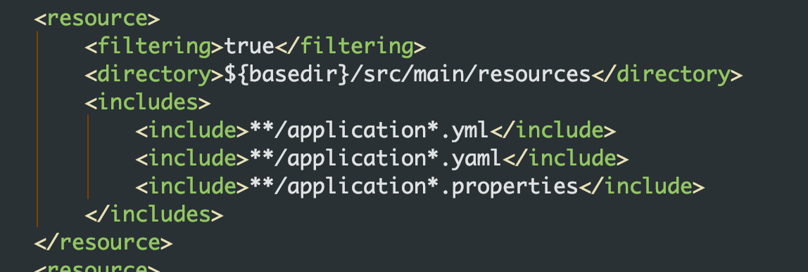
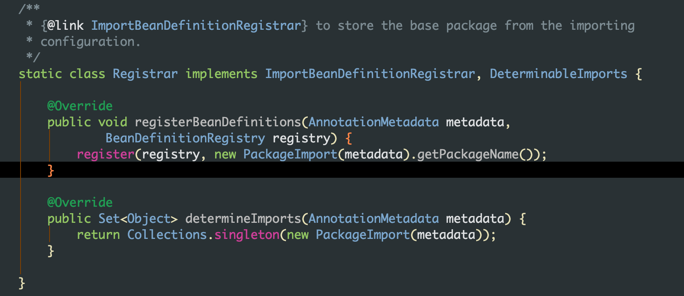
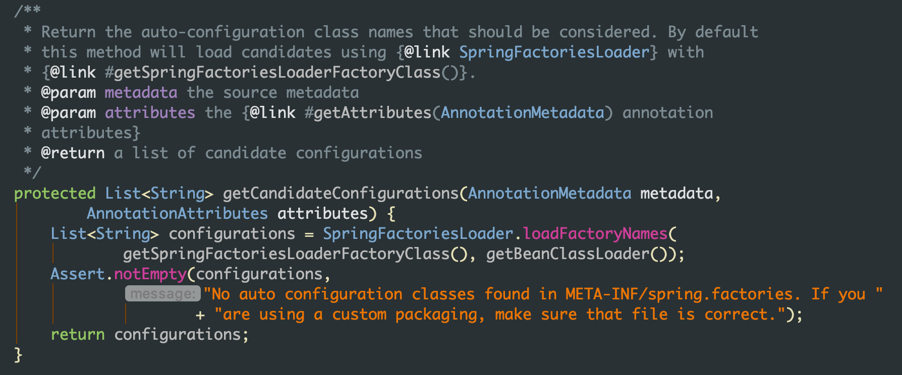
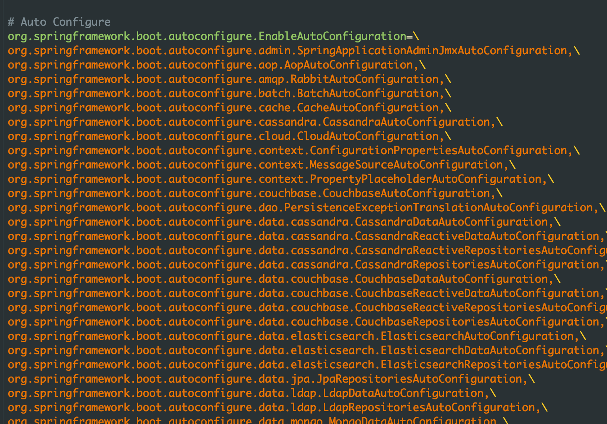

### SpringBoot

#### 简述

核心理念：**约定大于配置**

Springboot 并没有增强 Spring 的功能，而是封装了 Spring 原先复杂的配置，提供了快速使用的方式。

#### 依赖
```xml
<parent>
		<groupId>org.springframework.boot</groupId>
		<artifactId>spring-boot-starter-parent</artifactId>
		<version>2.0.5.RELEASE</version>
		<relativePath/> <!-- lookup parent from repository -->
	</parent>
```

内部通过 `<dependencyManagement>` 标签锁定了 spring 相关的版本号

* 配置文件
约定了配置文件的读取顺序，所以如果 properties 中覆盖了 yml 中的内容，那么配置最终读取的是 properties 因为 properties 是最后被读取的文件




#### 热部署
1. 引入 spring-boot-devtools  模块
2. IDEA 中配置 
   3. Compiler 选择 build project automatically
   2. Shift ctrl alt / 选择 Registry 选中 compiler

#### 自动配置

Springboot 的核心配置集成在 `@SpringBootApplication` 注解

```java
// 封装了 @Configuration 注解
@SpringBootConfiguration
// 实现自动配置
@EnableAutoConfiguration
@ComponentScan(
    excludeFilters = {@Filter(
    type = FilterType.CUSTOM,
    classes = {TypeExcludeFilter.class}
), @Filter(
    type = FilterType.CUSTOM,
    classes = {AutoConfigurationExcludeFilter.class}
)}
)
public @interface SpringBootApplication 
```

继续追踪 `EnableAutoConfiguration` 类

```java
// 自动配置包
@AutoConfigurationPackage
// 导入自动配置的组件
@Import(AutoConfigurationImportSelector.class)
public @interface EnableAutoConfiguration 
```

首先我们挖一下 `@AutoConfigurationPackage` 注解



可以看到添加这个注解后会自动扫描当前类路径及以下路径的所有类

而在 `AutoConfigurationImportSelector` 类完成了类的加载工作



而具体加载的类是在当前类的 META-INF/spring.factories 文件中



通常情况下，我们引入的文件的配置信息都会放在 META-INF 目录下的 JSON 文件

#### 单元测试

springboot 对于 spring 中的单元测试做了进一步的封装，但是本质上还是 spring 那套。

```java
@RunWith(SpringRunner.class)
// junit 指定启动方法
@SpringBootTest(classes = App.class)
// 指定 springboot 的启动类，
public class BdcXxblLogServiceImplTest {
    @Autowired
    private UserService userService;

    @Test
    public void testQueryUser() {
        userService.queryUser("123456");
    }
}

```

