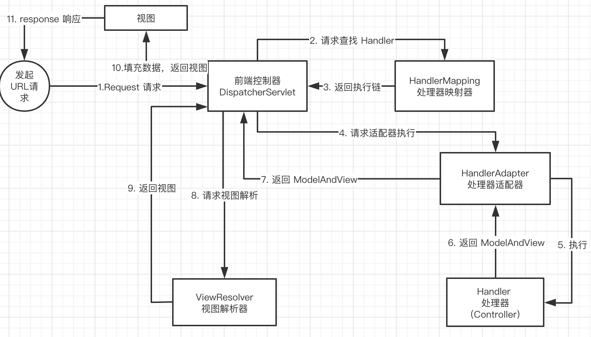
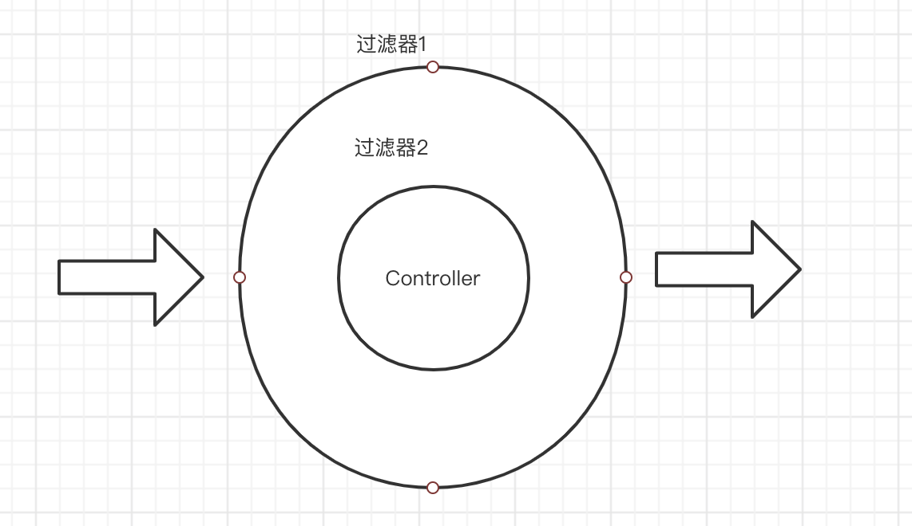

## Spring MVC 

基于 MVC 设计模式的轻量 级的 Web 框架，底层是基于 ServletApI 实现的，入口是 **Servlet** 并且是**单例**的。

Spring MVC 是作为表现层负责接收请求和响应结果
Spring 则是业务层的框架
Mybatis 是持久层的框架
#### SpringMVC 执行顺序



* DispatcherServlet 前端控制器
		核心，降低组件的耦合
* HandlerMapping 处理器映射器
		根据请求寻找处理器
* Handler 处理器
		具体业务控制器 Controller
* HandlerAdapter 处理器适配器 
		通过适配器执行更多类型的处理器
* ViewResolver 视图解析器
		解析地址生成视图

#### 注解
`@RequestMapping` headers：用于指定限制请求消息头的条件（防爬虫）
##### `@RequestParam` 
如果前端字段和方法中参数名一致时可以忽略不写，接收**请求头**中的参数，也就是在 url 中的参数。
```java
// SpringMVC 源码可以看出，如果没有添加 RequestParam 参数那么就会去取参数的名称
RequestParam requestParam = parameter.getParameterAnnotation(RequestParam.class);
String name = (requestParam == null || StringUtils.isEmpty(requestParam.name()) ?
               parameter.getParameterName() : requestParam.name());

```
可以通过注解的 required 属性去控制参数是否是必须的，注意默认 required 是 true，也就是说一旦添加了注解不去修改 required 那么所有的参数默认都是必须的。

required 不能判断是否为空，可以搭配 `@NotBlank` 和 `@Validated` 注解实现参数校验
##### `@RequestBody`
作用接收**请求体**中的参数

#### 类型转换器

> 中文乱码的解决：CharacterEncodingFilter 设置 encoding 为 UTF-8

**本质**就是 ` ConversionService`  中添加自定义的 `StringToDateConverter`

```java
// 实现接口 Converter<S, T> 代表字符串转 T
public class StringToDateConverter implements Converter<String, Date> {
  public Date convert(String source) throw Exception{
  	DateFormat df = new SimpleDateFormat("yyyy-MM-dd");
    return df.parse(source);
  }
}
```

配置类型转换器 ConversionServiceFactoryBean 中增加自定义的类型转换器
```xml
<bean id = "conversionService" class= "org.springframework.context.support.ConversionServiceFactoryBean">
	<property name = "converters">
		<set>
			<bean class="com.fox.utils.StringToDateConverter"/>
		</set>
	</property>
</bean>
<mvc:annotation-driven conversion-service="conversionService"/>
```
通过 JavaConfig 方式实现
```java
@Configuration
public class WebConfigBeans extends WebMvcConfigurerAdapter {
    @Autowired
    private RequestMappingHandlerAdapter requestMappingHandlerAdapter;

    /**
     * @description 处理实体中 String 转 Date 格式问题
     */
    @PostConstruct
    public void initEditableValidation(){
        ConfigurableWebBindingInitializer configurableWebBindingInitializer = (ConfigurableWebBindingInitializer) requestMappingHandlerAdapter.getWebBindingInitializer();
        if(configurableWebBindingInitializer.getConversionService()!=null){
            GenericConversionService service = (GenericConversionService) configurableWebBindingInitializer.getConversionService();
            service.addConverter(new StringToDateConverter());
        }
    }
}

```


**获取原生 ServletAPI**：参数设置为： HttpServletRequest 和 HttpServletResponse 

#### 文件上传

* 配置文件解析器

  ```xml
  <bean name="multipartResolver" id="org.springframework.web.multipart.commons.CommonsMultipartResolver">
    <property name="maxUploadSize" value = "10*1024*1024"/>
  </bean>
  ```
  
* 参数 MultipartFile 

#### 拦截器

|   过滤器   | 拦截器     |
| ---- | ---- |
| **servlet 规范，只能作用于 Web** | Spring管理，支持Web 和 Application |
| 配置后对于所有要访问的资源拦截 | 只会拦截控制器方法，资源不会拦截 |
| Servlet 规范                     | Spring 框架的组件 |
| 无法使用 Spring 资源 | 使用 Spring 资源 |

拦截器是 AOP 思想的具体应用



拦截器的创建必须要实现 `HandlerInterceptor` 接口，配置拦截器即可

```java
@Configuration
public class ApiConfigurer extends WebMvcConfigurerAdapter {

    /**
     * 把拦截器注入为bean
     * @return
     */
    @Bean
    public HandlerInterceptor getMyInterceptor(){
        return new CommonInterceptor();
    }

    @Override
    public void addInterceptors(InterceptorRegistry registry) {
      // 注册拦截器      
      registry.addInterceptor(getMyInterceptor()).addPathPatterns(checkPath);        							super.addInterceptors(registry);
    }

    @Override
    public void addViewControllers(ViewControllerRegistry registry) {
        registry.addViewController("/view/index").setViewName("index");
      	// 重定向，短链接
        registry.addRedirectViewController("/home","home/home-page.html?clientId=**&moduleCode=*&loadHome=true");
        super.addViewControllers(registry);
    }
}
```

#### 异常处理

实现 `HandlerExceptionResolver` 接口，编写异常处理逻辑即可

**springboot 中可以使用**`ControllerAdvice` 实现异常处理功能

实现逻辑就是 dao,service 和 web 都把异常向上抛，最终被前端处理器接收交给异常处理器统一处理